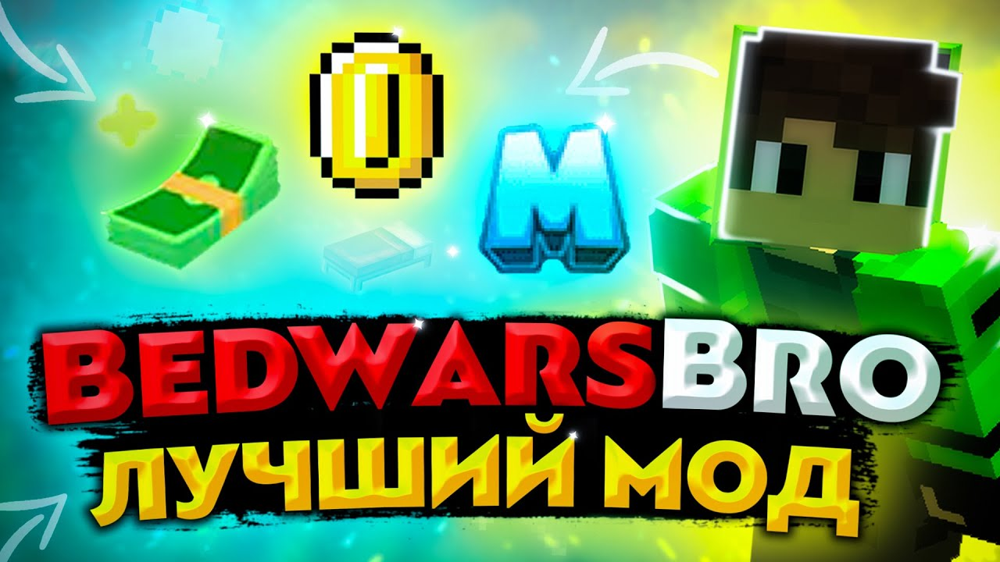

# BedwarsBro
BedwarsBro is a mod for Minecraft (for version ForgeOptifine 1.8.9) that introduces an insane amount of valuable game-changing client-side features.

**Technical Details:**
- **Programming Language:** Java
- **Project Scale:** The mod encompasses over 16,000 lines of code, making it my most extensive project to date.

**Development Journey:**
- **Creation:** I developed this mod at the age of **16**.
- **Time Investment**: The project took approximately 3 months to complete, with daily coding sessions lasting 3-8 hours.

**Community Impact:**
- **User Engagement:** The mod has been downloaded by over **50.000** players, according to my download statistics.
- **Feedback:** I've received numerous compliments, suggestions, and expressions of gratitude from the community, highlighting the positive reception of the mod.

**Additional Resources:**
- **Demonstration:** I created a YouTube video showcasing the mod's features, though it is currently available only in Russian <a href='https://www.youtube.com/watch?v=0qWJpeQj83E'>Watch the video here</a>

 
